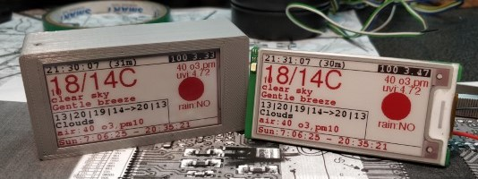
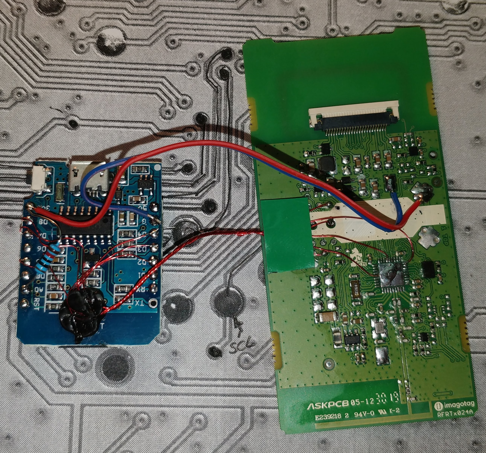
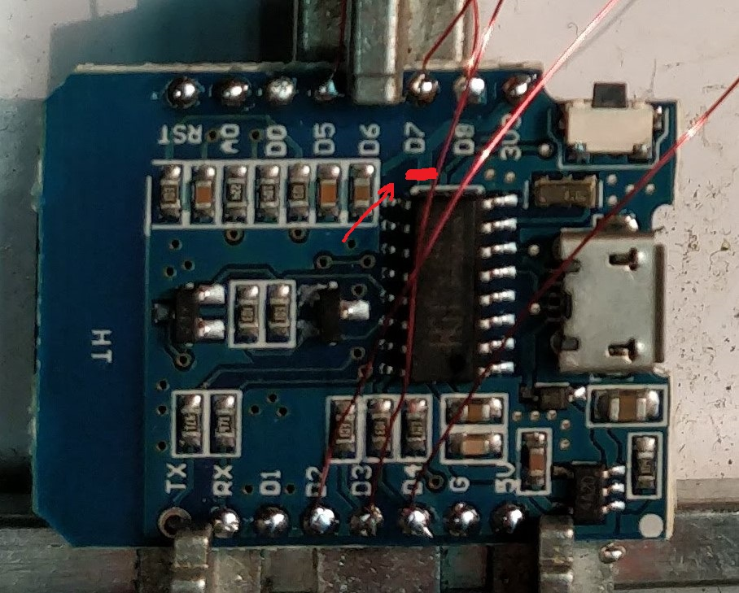

## Reuse of not working price tag (SES imagotag Vusion 2.6 BWR) display as weather display.

Parts:
* price tag
* esp8266 - Wemos Mini
* Holtek HT7333 Low Power Consumption LDO 3.3V
* capacitor 470μF, 
* 1S protected lipo battery
* 1S usb charger

Goals:
* be able to run on battery for some time
* be able to display text and lines
* automatic firmware update
* controlled via MQTT to be easly integrated with NodeRed

---

## Hardware connections
Main CPU has to me removed from the display board.
Wemos Mini is connected as follows.

BUSY -> D2, RST -> D4, DC -> D3, CS -> D8, CLK -> D5, DIN -> D7, GND -> GND, 3.3V -> 3.3V

[PCB and connections](files/teardown.png)

There is a resistor between A0 and 3.3V pins to allow input voltage mesuring.

Also jumper needs to be added between RST and D0 to allow deep sleep and wake up. 

Everything is powered via 3.3V PIN on Wemos Mini from HT7333 LDO with 470μF capacitor on output and 10μF on input.

A trace makerd red on below picture has been cut to remove power from ch340 chip to reduce power consumption even more.
CH340 is still powered from USB so ESP8266 can be programmed from USB too.

Power consumption in deep sleep is about 1mA.

---

Display controlled via MQTT and json
based on epaper price tag + wemos mini

example json:

    {"v":11,"NR":1260,"i":1,"ic":1,
    "d":[
    {"x":1,"y":10,"f":0,"c":0,"t":"22:10:16 (21m)"},

    {"x":0,"y":50,"f":5,"c":1,"t":"25/25C"},
    {"x":0,"y":65,"f":0,"c":1,"t":"clear sky"},
    {"x":0,"y":80,"f":0,"c":1,"t":"Light air"},

    {"x":220,"y":110,"f":2,"c":1,"t":"rain:NO"},

    {"x":0,"y":150,"f":0,"c":1,"t":"Sun:7:26:07 - 20:05:56"},

    {"x":220,"y":30,"f":2,"c":1,"t":"60 o3"},
    {"x":220,"y":45,"f":2,"c":1,"t":"uvi:4.67"},

    {"x":0,"y":100,"f":0,"c":0,"t":"21|32|29|27->33|21"},
    {"x":0,"y":115,"f":0,"c":0,"t":"Clouds"}
    ],
    "l":[
        {"x1":0,"y1":13,"x2":296,"y2":13, "c":0},
        {"x1":0,"y1":85,"x2":200,"y2":85, "c":0},
        {"x1":200,"y1":85,"x2":200,"y2":137, "c":0},
        {"x1":200,"y1":85,"x2":200,"y2":13, "c":0},
        {"x1":0,"y1":137,"x2":296,"y2":137, "c":0}
    ]}

* NR - next refresh in seconds
* i -  icon number to display
* d - data array
* x,y - coordinates
* f - font ( 0 small , 1 big)
* c - color (0 black, 1 red)
* t - text
* l - lines array

example script NodeRed:

    const minute= 60;
    var NR = 30*minute;
    var long = 60*minute;

    // NR = 10000;

    var d = new Date();
    var h = d.getHours();
    var m = d.getMinutes();

    if(30-m>0)
    {
        NR = (30-m)*minute;
    }else {
        NR=(60-m)*minute;
    }

    switch(h)
    {
        case 0: NR=long; break;
        case 1: NR=long; break;
        case 2: NR=long; break;
        case 3: NR=long; break;
        case 4: NR=long; break;
        case 5: NR=long; break;
    default:
        break;
    }

    var scale =['Calm', 'Light air', 'Light breeze', 'Gentle breeze', 'Moderate breeze', 'Fresh breeze', 'Strong breeze', 'High wind', 'Gale', 'Strong gale', 'Storm', 'Violent Storm', 'Hurricane'];
    var wind = msToBeaufort(msg.payload.windspeed);

    var icon =msg.payload.icon;

    var s = `{"NR":${NR},"i":${parseInt(icon.substring(0, 2))},"d":[{"x":1,"y":10,"f":0,"c":0,"t":"`+startTime()+` (${NR/minute}m)"},
    {"x":10,"y":50,"f":1,"c":1,"t":"${msg.payload.tempc}C"},
    {"x":10,"y":90,"f":1,"c":1,"t":"${msg.payload.weather}"},
    {"x":10,"y":110,"f":0,"c":0,"t":"${msg.payload.detail}"},
    {"x":10,"y":125,"f":0,"c":0,"t":"${scale[wind]}"},
    {"x":10,"y":150,"f":0,"c":0,"t":"Sun:${time(msg.payload.sunrise)} - ${time(msg.payload.sunset)}"},
    {"x":180,"y":30,"f":0,"c":1,"t":"${global.get("air")}"}
    ]}`;

    msg.payload=s; 

    node.status({text:"NR:"+NR/minute+"minutes"});

    return msg;

    function msToBeaufort(ms) {
        return Math.ceil(Math.cbrt(Math.pow(ms/0.836, 2)));
    }

    function financial(x) {
    return Number.parseFloat(x).toFixed(2);
    }

    function state(x) {
    if(x) return "OK";
    else return "!!";
        
    }

    function startTime() {
        var date = new Date();
        var hours = date.getHours();
        // Minutes part from the timestamp
        var minutes = "0" + date.getMinutes();
        // Seconds part from the timestamp
        var seconds = "0" + date.getSeconds();

        // Will display time in 10:30:23 format
        var formattedTime = hours + ':' + minutes.substr(-2) + ':' + seconds.substr(-2);
        return formattedTime;
    }

    function time(t) {
        var date = new Date(t * 1000 );
        var hours = date.getHours();
        // Minutes part from the timestamp
        var minutes = "0" + date.getMinutes();
        // Seconds part from the timestamp
        var seconds = "0" + date.getSeconds();

        // Will display time in 10:30:23 format
        var formattedTime = hours + ':' + minutes.substr(-2) + ':' + seconds.substr(-2);
        return formattedTime;
    }